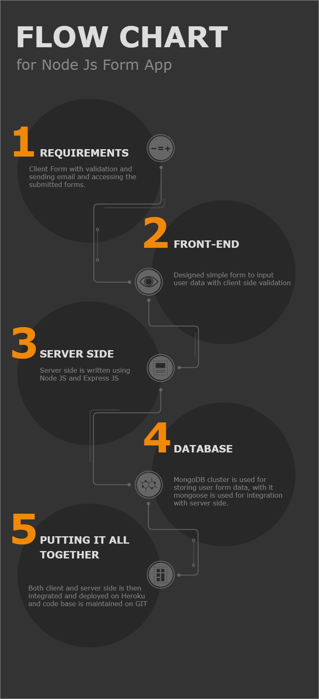

# [ParkZapLabsTask-BackendDEMO](https://parkzaplabstask.herokuapp.com/)
## [Video Recoding](https://drive.google.com/file/d/1Xj-W_4J9Lvz1IOe8VtvixtIRfsfWJFdQ/view?usp=sharing)

___

 
 
 ___

## PROJECT DESCRIPTION

#### INTRODUCTION
**This is a Node Js Form app which enables form data validation and storing the forms in a Mongodb database in the cluster for safe and secure data access**

#### MODULES AND LIBRARIES USED
   - NODE JS
   - EXPRESS JS
   - MONGODB
   - MONGOOSE
   - NODEMAILER
   - EJS
   - BOOTSTRAP
   - FONT AWESOME

#### ASSIGNED TASKS
   - [x] UI/UX Design
   - [x] Client Side Validation
   - [x] Mongodb Cluster Connection
   - [x] Server Side code
   - [x] Server Side Validation
   - [x] Sending Success Mails
   - [x] Deployment to heroku

#### CONCLUSION
  The App is up and working as required, and it was a good learning experience to develop and deploy a fully functional app to the server

